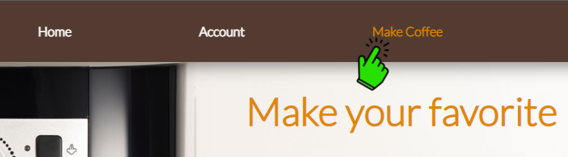
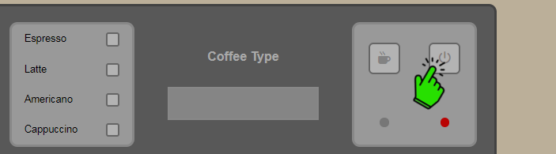
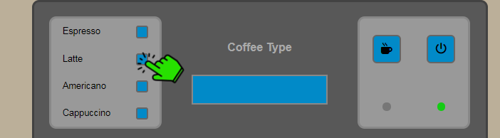
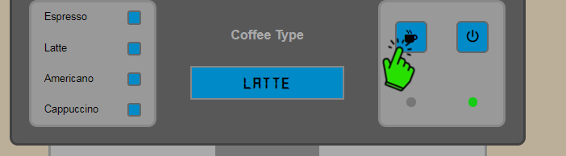
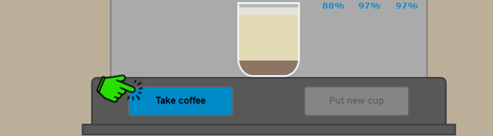
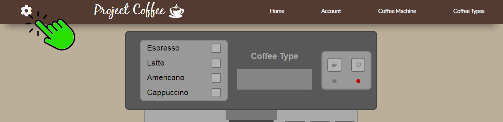
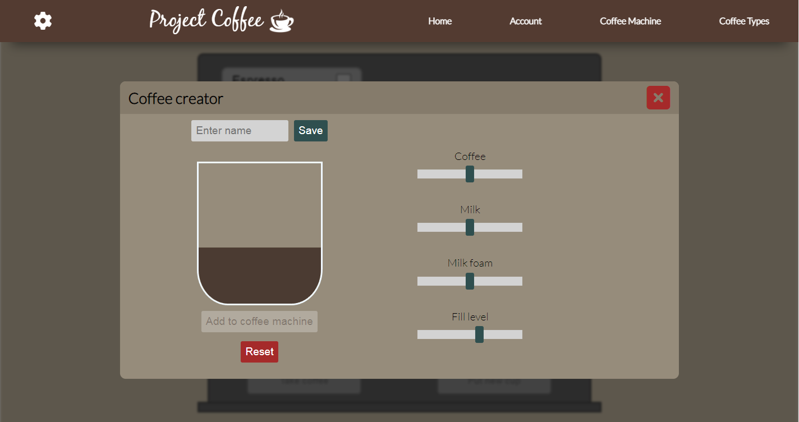
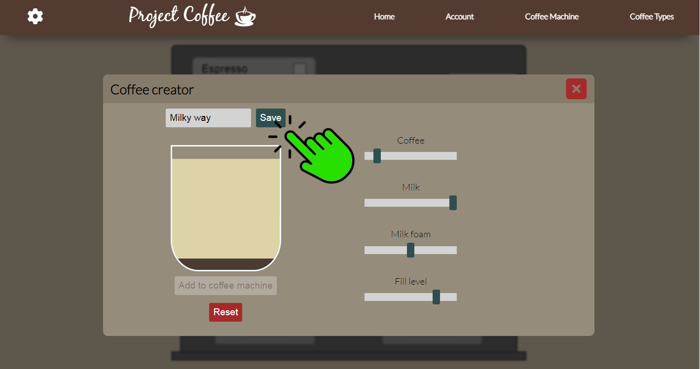
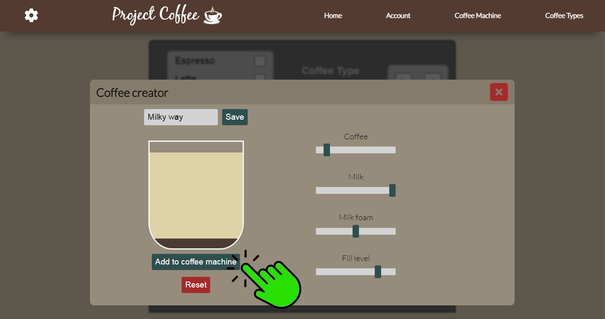
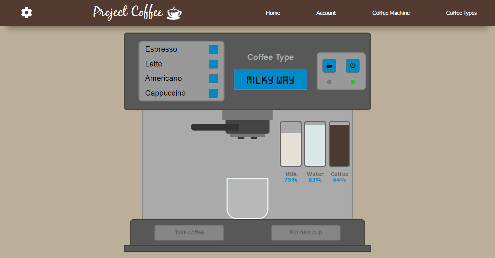

# Project-Coffee
This project is a sort of simulation of coffee brewing using a coffee machine.

## Introduction
It's a training project. I wanted to do this project to learn the basics of frontend technologies. I didn't use any frameworks or other libraries.

## Table of contents
* [Used technologies](https://github.com/Bartolem/Project-Coffee#used-technologies)
* [How to use](https://github.com/Bartolem/Project-Coffee#usage)
* [Custom coffee creation](https://github.com/Bartolem/Project-Coffee#custom-coffee-creation)

## Used technologies
* HTML
* CSS
* JavaScript

## Description
The heart of this project is the coffee machine. This machine has made brewing coffee simple. The user can choose the type of coffee. Remember that the ingredients needed to create this drink are gradually running out, so they must be refilled.

## How to use
1. On the navigation bar, click on the make coffee tab.

 
 
 

2. Turn on the machine by pressing the button.

 
 
 

3. Choose a coffee type.
 
 
 
 

4. Press the button responsible for pouring coffee.

 
 
 

5. Take the coffee cup and put a new empty cup to repeat the process.

 
 
 

## Custom coffee creation
1. Click the gear icon, and select create coffee option.

 
 
 

2. Create custom coffee by changing the slider position.

 
 
 

3. Set the name of your coffee.

 
 
 

4. Add your creation to the coffee machine.

 
 
 

5. Now, you can pour your coffee.

