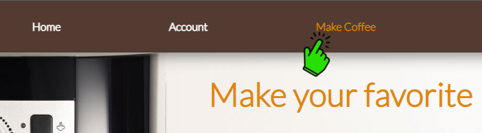
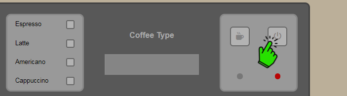
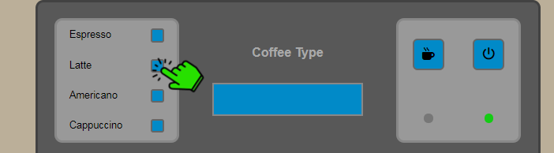
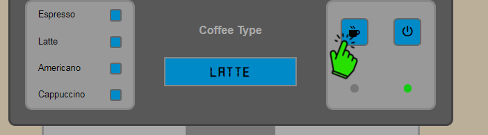
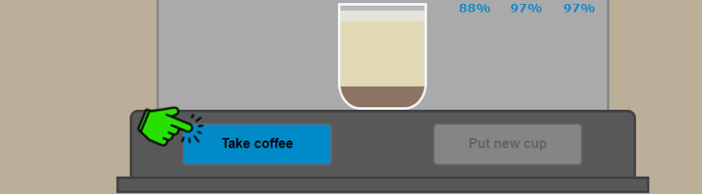

# Project-Coffee
## About
This project is a sort of simulation of coffee brewing using an coffee machine.

## Used technologies
* HTML
* CSS
* Java Script

## Description
The heart of this project is the coffee machine. This machine has made brewing coffee simple. The user can choose the type of coffee. Must keep in mind that the ingredients needed to create this drink are gradually running out, so they must be refilled.

## Usage
1. On the navigation bar, click on the make coffee tab.

2. Turn on the machine by pressing the button.

3. Choose coffee type.

3. Press the button responsible for pouring coffee.

4. Take the coffee cup and put a new empty cup to repeat the process.

